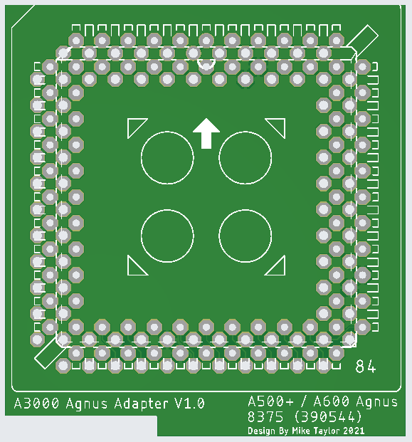
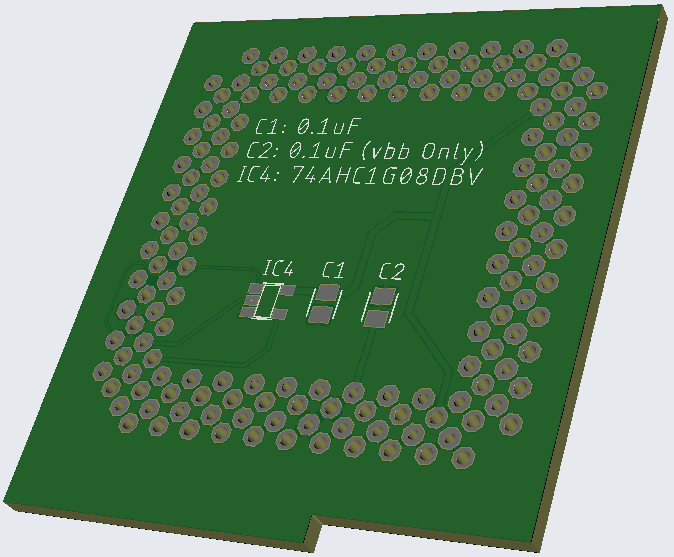
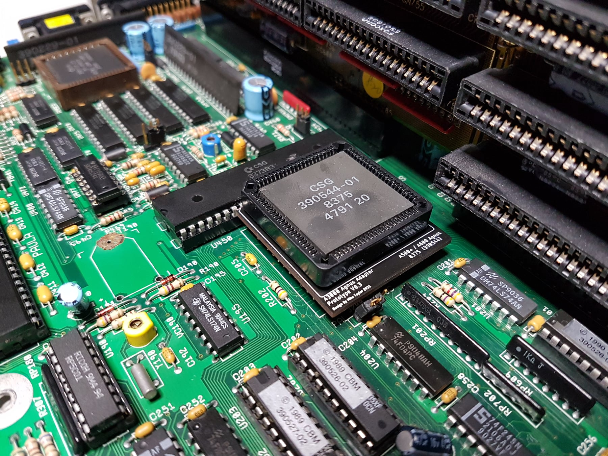
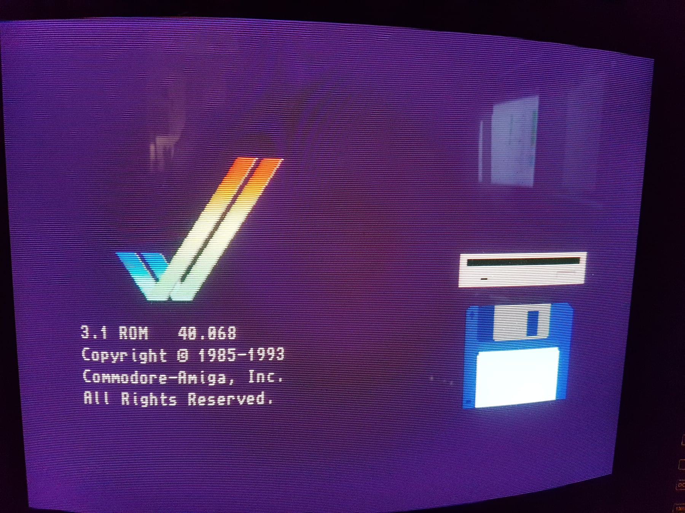

# A3000-Agnus-Adapter

## Intoduction
With the 8372B Agnus being a rare and expensive beast this adator was designed to allow the use of the relativly common 390544 (8375) 2MB Agnus from the A500+ and A600 in the A3000. 

## PAL or NTSC
Unlike the 8372B which can be changed between NTSC and PAL with a jumper, the 8375 (390544) can not. 

When selecting an Agnus chip to use with this adaptor there are two choices that have been tested:

1. 390544-01 PAL 2MB Agnus used in Eurpean A500+ and A600
2. 390544-02 NTSC 2MB Agnus Used in North American A500+ and A600

Other variants of the Agnus chip exist and provision has been made for then Vbb connection on pin 40 (C14M). 

If using one of the chips marked Vbb, C2 should be populated with a 0.1uF ceramic capacitor.

**Please note I have not tested any of the below chip revisions so the following info is provided as-is**

>318069-10
>Several pins have been changed to support the A600. This device supports PAL only - the PAL/_NTSC pad is internally pulled up to Vdd (+5). This part is the new rev of >what was previously called 390554-01, except that Vbb replaces the C14M pin.
>
>318069-11
>This pinout is identical to the -10. However, this device supports NTSC only - the PAL/_NTSC pad is internally connected to GND. This part is the new rev of what was >previously called 390554-02, except that Vbb replaces the C14M pin.
>
>318069-12
>Several pins have been changed to support the A600. This device supports PAL only - the PAL/_NTSC pad is internally pulled up to Vdd (+5). This part is the new rev of >what was previously called 390554-01.
>
>318069-13
>Several pins have been changed to support the A600. This device supports NTSC only - the PAL/_NTSC pad is internally connected to ground. This part is the new rev of >what was previously called 390554-02.

Source of above info > https://www.amigawiki.org/lib/exe/fetch.php?media=de:parts:agnus-history.pdf

## Components

| Component                                   | Location  | Qty | Link |
| ------------------------------------------- | --------- | --- | ---- |
| Ceramic Capacitor, 0.1uF, 0805              | C1, C2    | 2   |  [Mouser](https://www.mouser.com/ProductDetail/710-885012207098)    |
| 74AHC1G08 Single 2-Input AND Gate, SOT-23-5 | IC4       | 1   |  [Mouser](https://www.mouser.com/ProductDetail/595-SN74AHC1G08DBVR)    |
| PLCC 84 THT Socket                          |           | 1   | [Mouser](https://www.mouser.com/ProductDetail/3M-Electronic-Solutions-Division/8484-11B1-RK-TP?qs=WZRMhwwaLl9eNFJXLRGlFw==) |

## Thanks
Thankyou to all the people who have helped with this project.

- Tristan Zondag for testing the adaptor (1st person to get it fully working)
- [Matt Harlum Liv2](https://github.com/LIV2) RAS signal combining inspired by the [A500-2Meg-Chip-ram](https://github.com/LIV2/A500-2Meg-Chip-ram) project.
- [John Chucky Hertell](https://github.com/ChuckyGang) & Peter Mulholland, initial conversations about the idea of using an A500+ Agnus. 
